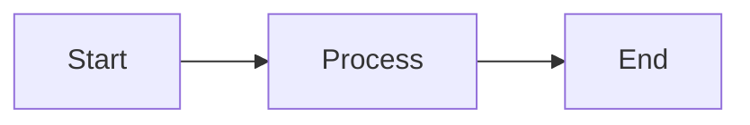
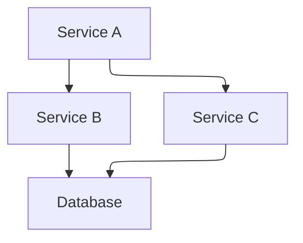
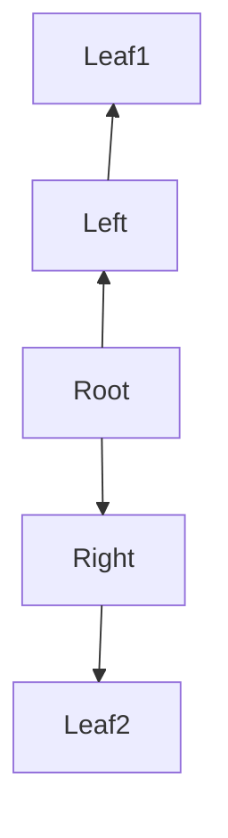
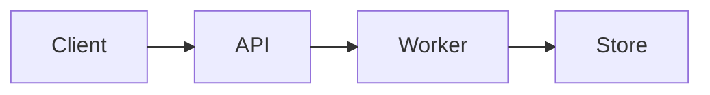
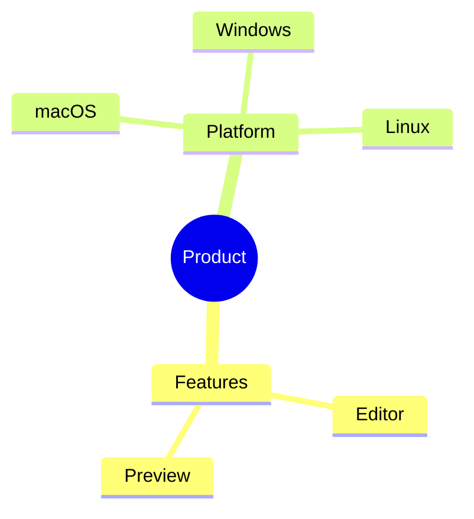

# Mermaid layout samples

Manual QA fixture for Dickory Docs layout renderers. Open this file in the app and confirm each diagram renders (preview, expand modal, diagram gallery).

## Dagre baseline (default)

## ELK via init directive

## ELK via YAML frontmatter (stress layout)

## flowchart-elk diagram type

## Tidy-tree mindmap

