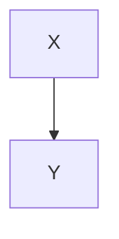

# Untagged Mermaid sample

Connor-style fence (plain triple backticks, no `mermaid` tag):

```
%%{init: {'theme': 'dark'}}%%
graph LR
    A([Start]) --> B[Step]
```

This Python block must stay a code block, not a diagram:

```python
graph TD
    print("not mermaid")
```

Tagged block still works:


